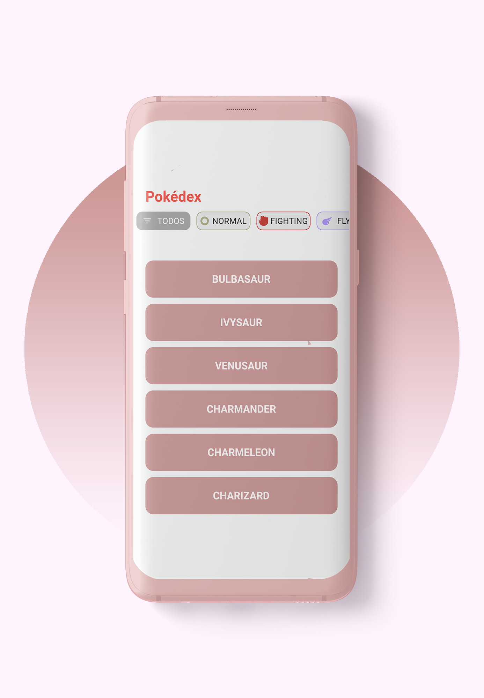
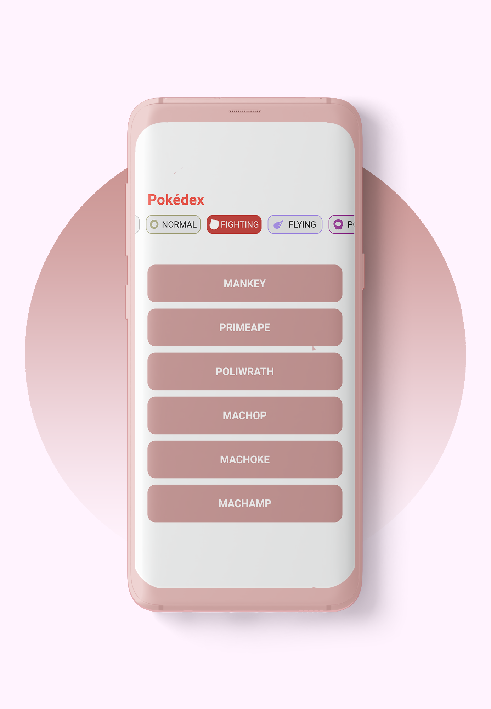
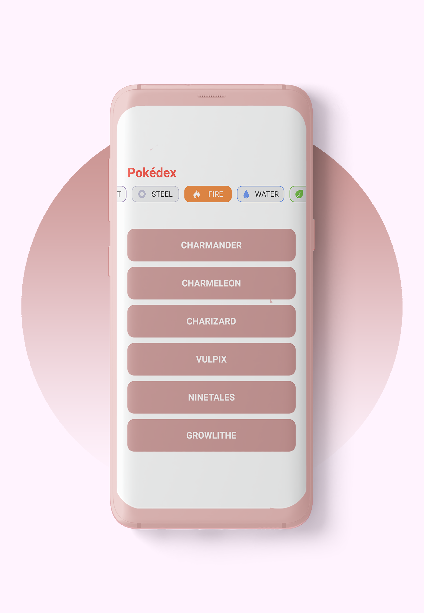
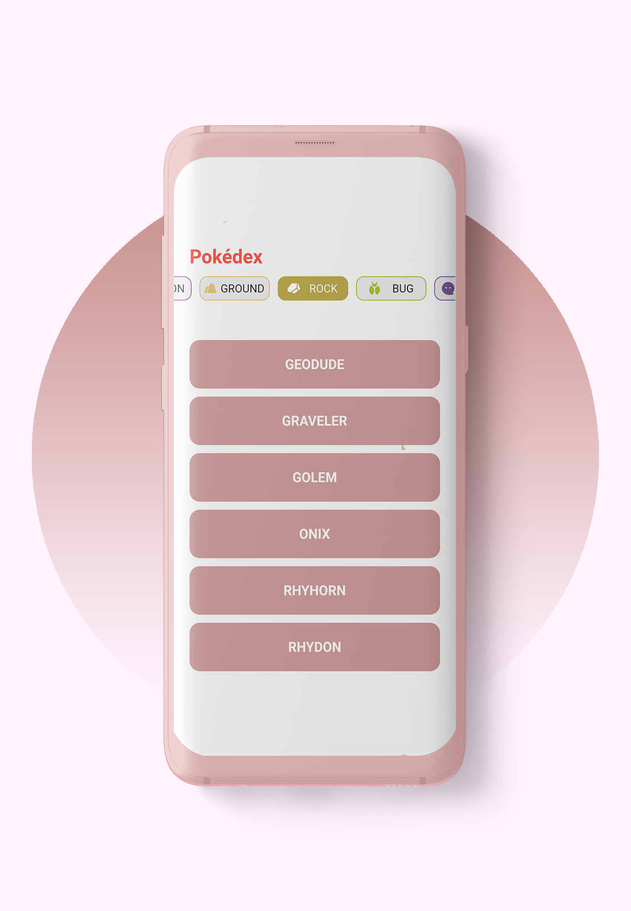
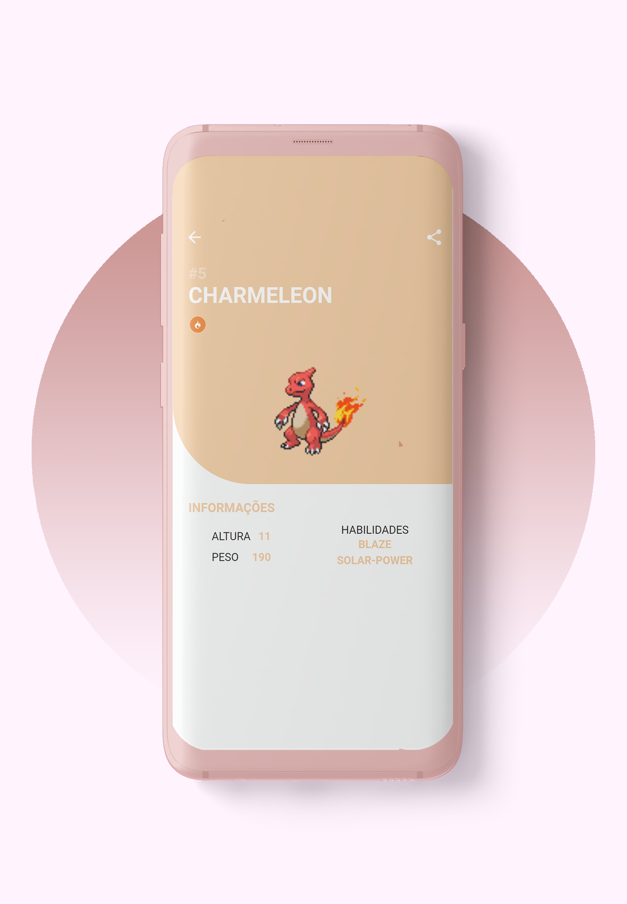
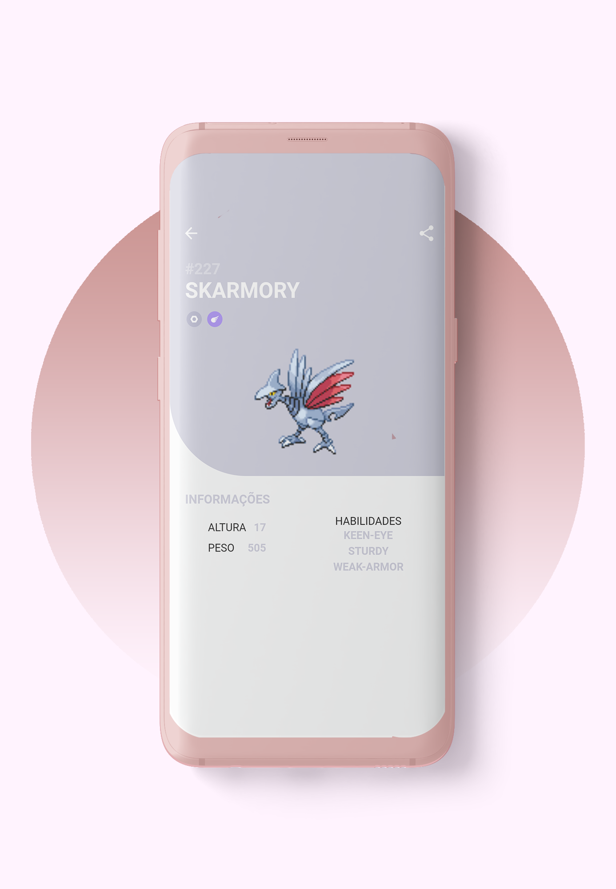

# Desafio Pokemon App

Flutter Pokedex App

# Imagens

  

   

 

# Bibliotecas Usadas

dio: ^4.0.0 - https://pub.dev/packages/dio
Biblioteca para suporte de requisições

flutter_svg: ^0.22.0 - https://pub.dev/packages/flutter_svg
Biblioteca para o uso de SVGs

provider: ^5.0.0 - https://pub.dev/packages/provider
Biblioteca para auxílio de gerenciamento de estados

share: ^2.0.1 - https://pub.dev/packages/share
Biblioteca para compartilhar conteúdo do aplicativo

## Getting Started

This project is a starting point for a Flutter application.

A few resources to get you started if this is your first Flutter project:

- [Lab: Write your first Flutter app](https://flutter.dev/docs/get-started/codelab)
- [Cookbook: Useful Flutter samples](https://flutter.dev/docs/cookbook)

For help getting started with Flutter, view our
[online documentation](https://flutter.dev/docs), which offers tutorials,
samples, guidance on mobile development, and a full API reference.
